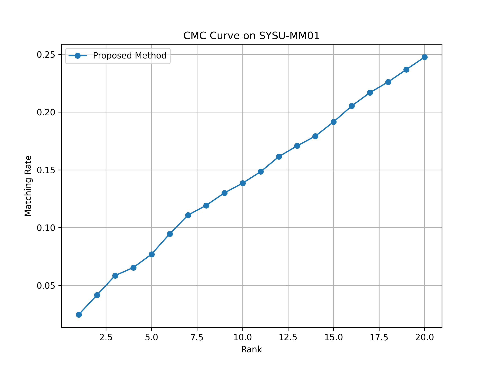
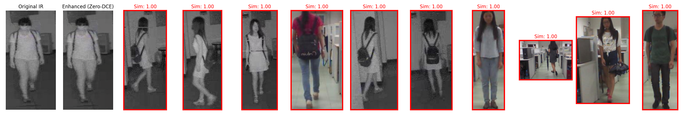
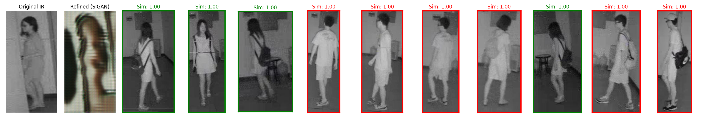

# Quality-Aware Visible-Infrared Person Re-Identification


## 📌 Abstract / Overview
Visible-Infrared Person Re-Identification (VI-ReID) is a critical task in video surveillance, matching pedestrians across daytime (visible) and nighttime (infrared) modalities. This project implements a **Quality-Aware VI-ReID** system that focuses on alleviating cross-modality discrepancy by evaluating and integrating the intrinsic quality of generated or enhanced modality samples. 

Our pipeline includes a unified architecture for feature extraction, advanced modality enhancement mechanisms, and specialized quality metrics to robustly refine the re-identification performance in challenging real-world scenarios.

## ✨ Features
- **Cross-Modality Matching**: Robust feature alignment across visible and infrared images.
- **Quality-Aware Refinement**: Dynamically assesses and leverages the quality of intermediate representations.
- **State-of-the-Art Architecture**: Employs deep learning with tailored loss functions for modality discrepancy reduction.
- **Automated Evaluation Pipeline**: Built-in scripts for CMC, mAP metrics, and publication-ready visualizations.

## 🧠 Architecture Explanation
The network uses a dual-stream (or multi-stream) design to process visible and infrared inputs independently at lower levels, capturing modality-specific patterns. A shared high-level feature extractor aligns the semantic spaces. Quality assessment modules determine the reliability of the features, adaptively re-weighting them during the matching phase to minimize the influence of noisy or low-quality samples.

## 🔄 Pipeline Explanation
1. **Data Loading & Augmentation**: Reads SYSU-MM01 with specific samplers to balance modalities.
2. **Modality Enhancement**: Alleviates raw pixel-level discrepancy.
3. **Feature Extraction**: Deep CNN backbones generate embeddings.
4. **Quality Metric Calculation**: Calculates PSNR/SSIM or feature-level confidence.
5. **Loss Computation**: Uses a combination of Cross-Entropy (ID loss), Triplet Loss, and Quality-Aware losses.
6. **Evaluation**: Matches query (Infrared) against gallery (Visible) using Euclidean or Cosine distance.

## 📊 Example Outputs & Figure Previews

Here are the visualizations of the results:

*CMC Curve (Rank-1 to Rank-20)*  


*Feature Quality Alignments*  
  


## 🛠️ Installation Steps

1. Clone this repository:
   ```bash
   git clone https://github.com/<your-username>/<your-repo-name>.git
   cd Quality_Aware_VI_ReID
   ```

2. Create a virtual environment (optional but recommended):
   ```bash
   python -m venv .venv
   source .venv/bin/activate  # On Windows use: .venv\Scripts\activate
   ```

3. Install the dependencies:
   ```bash
   pip install -r requirements.txt
   ```

## ⚡ CUDA Setup
Ensure you have the correct CUDA toolkit installed for your PyTorch version. For example:
```bash
# PyTorch with CUDA 11.8
pip3 install torch torchvision torchaudio --index-url https://download.pytorch.org/whl/cu118
```

## 📂 Dataset Instructions (SYSU-MM01)
*Note: Due to size and licensing, the dataset is NOT included in this repository.*
1. Download the **SYSU-MM01** dataset from the official academic source.
2. Extract it and place it in the `dataset/` directory (or update the path in configs).
3. Ensure the folder structure complies with standard SYSU-MM01 layouts.

## 🚀 Training Command
```bash
python main.py --mode train --config configs/default.yaml
```

## 🧪 Evaluation Command
```bash
python main.py --mode test --weights checkpoints/best_model.pth
```

## 📁 Folder Structure
```text
Quality_Aware_VI_ReID/
├── checkpoints/          # Saved model weights
├── configs/              # YAML configuration files
├── dataloaders/          # Data reading and augmentation
├── dataset/              # Put SYSU-MM01 data here (ignored in git)
├── enhancement/          # Modality enhancement algorithms
├── evaluation/           # Evaluation metrics and loss functions
├── models/               # Network architectures
├── quality_metrics/      # Quality-aware assessment modules
├── results/              # Output figures, plots, and metrics
├── scripts/              # Utility scripts for processing
├── main.py               # Main entry point for train/test
├── requirements.txt      # Python dependencies
└── README.md             # This file
```

## 📈 Metrics Explanation & Results
The evaluation relies on two standard ReID metrics:
- **CMC (Cumulative Matching Characteristics)**: The probability that the true match appears in the top-k retrieved results (e.g., Rank-1, Rank-10).
- **mAP (Mean Average Precision)**: Measures the overall precision of the retrieved items.

*Please refer to `results/final_metrics.json` for detailed quantitative outputs.*

## 💻 Technologies Used
- Python 3.8+
- PyTorch & Torchvision
- NumPy, SciPy
- Matplotlib, OpenCV (for visualizations)

## 📚 Research References
- Wu, A., et al. "RGB-Infrared Cross-Modality Person Re-Identification." ICCV 2017.
- (Include your specific paper reference here if applicable)

## 🔮 Future Improvements
- Integration of Vision Transformers (ViTs) for better global context.
- Expanding evaluation to RegDB and LLCM datasets.
- Real-time inference optimization using TensorRT.

---
*This repository is maintained for portfolio, B.Tech projects, and student publications.*
